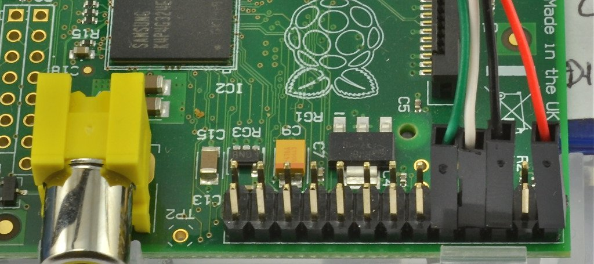

The following process will allow you to setup your Raspberry Pi 3 without the need of a monitor, keyboard, or mouse. However, this assumes you have a [serial cable](https://www.adafruit.com/product/954), which can be purchased from Adafruit

- Download [Raspian](https://www.raspberrypi.org/downloads/raspbian/)
	- Follow the [Installation Instructions](https://www.raspberrypi.org/documentation/installation/installing-images/README.md) for your OS
	- NOTE: if you're using `dd`, you can check it status by typing `ctrl-T` in the console where you executed the command
- Turn on the serial interface
	- [Configuring The GPIO Serial Port On Raspbian Jessie Including Pi 3](http://spellfoundry.com/2016/05/29/configuring-gpio-serial-port-raspbian-jessie-including-pi-3/)
	- Edit /boot/config.txt
	- Add `enable_uart=1` to the botton of that file and save
- Connect Serial Cable
	
- Setup WiFi interface
	- add the following replacing the `Network Name` and `Network Password`, as is appropriate for your wireless network.
	```
	network={
		ssid="Network Name"
		psk="Network Password"
	}
	```
	- restart the interface
	```
	sudo ifdown wlan0
	sudo ifup wlan0
	```
	- after less than a minute the following should show a valid IP address
	```
	ifconfig wlan0
	```
- Update the OS
	- `sudo apt-get update`
	- `sudo apt-get upgrade`

At this point have a very basic install of Raspian on your Raspberry Pi 3. You can log into Pi via a serial connection, but you also have the option of connecting via ethernet.

If you find that you need to access the GUI of the Pi, but you still don't want to hook up a keyboard, mouse, and monitor, then you can install TightVNC and then access the GUI from your computer with a VNC client.

- Install VNC server and start it on raspi
	- `sudo apt-get install tightvncserver`
	- `tightvncserver`
	- set password
- Connect from Mac
	- cmd-K
	- vnc://pi@192.168.0.1:5901
	- enter password
- Auto-start
	- [VNC](https://www.raspberrypi.org/documentation/remote-access/vnc/)
