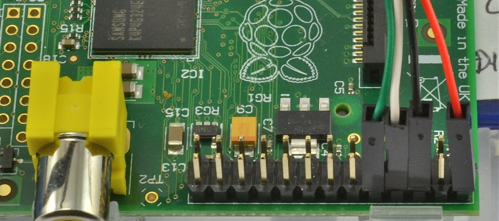

# Raspberry Pi

Suggested configuration and software for Raspberry Pi 3

## Initial setup

- Download Raspian
- Format SDHC to FAT32
- Install Raspian on SDHC
    - The following is an example for mac os and Linux
    - `sudo dd bs=1m if=~/Downloads/2016-05-27-raspbian-jessie.img of=/dev/rdisk6`
- Connect mouse, keyboard, HDMI, and power to raspi 3

## After boot

- Open Menu->Preferences->Raspberry Pi Configuration
    - Open Interfaces tab
    - Enable Camera, SSH, I2C, and Serial
    - Open Localisation tab
    - Set values for Locale, Timezone, Keyboard, and WiFi Country
    - close and reboot
- Setup WiFi
    - Only need if using raspi 3 and if you wish to connect to your wifi
    - Click network icon in menbar (two computer icon at top-right)
    - Select your network
    - Enter your network password
    - Alternately, you can configure wifi from the command line
    ```
    # find the name of the network you want to join
    sudo iwlist wlan0 scan | grep "ESSID"
    sudo vi /etc/wpa_supplicant/wpa_supplicant.conf
    
    # add the following replacing the network name and password, as appropriate
    network={
        ssid="Network Name"
        psk="Network Password"
    }

    # restart the interface
    sudo ifdown wlan0
    sudo ifup wlan0

    # after less than a minute the following should show a valid IP address
    ifconfig wlan0
    ```
- Setup static IPv4 address
    - Used for direct connect from a laptop/desktop. That setup requires a cross-over ethernet cable
    - see https://www.modmypi.com/blog/how-to-give-your-raspberry-pi-a-static-ip-address-update
    - edit /etc/dhcpcd.conf
        - add the following to the end of the file and save
        ```
        interface eth0
        static ip_address=192.168.0.x/24
        ```
- Open terminal
    - `sudo apt-get update`
    - `sudo apt-get upgrade`
    - `sudo apt-get install vim`
        - optionally install color schemes like monokai, badwold, and solarized
    - `sudo apt-get install i2c-tools`
        - optionally install smbus for i2c support in Python 3
        - `sudo apt-get install python3-smbus`
    - `sudo apt-get install tmux`
- Set terminal for `screen`
    - You can list `screen` terminal types with the following
        - `find $(infocmp -D) -printf '%f\n' | sort -u | grep screen`
    - `vim ~/.bash_profile`
    - add the following
    ```
    if [[ $(tty) = /dev/ttyS* ]]; then
        export TERM=screen-256color
    fi
    ```
- Install Adafruit Python PCA9685 (Servo/PWM)
    ```
    git clone https://github.com/adafruit/Adafruit_Python_PCA9685.git
    cd Adafruit_Python_PCA9685
    sudo python setup.py install
    ```

## git

- Use the following to generate an SSH key for the raspi. This is needed for pushing to remote git services like GitHub and BitBucket
    - `ssh-keygen -t rsa -b 4096 -C "kevin@kevlindev.com"`
- If you used a passphrase with your SSH key (you should), then run the following. You may want this in your login script
    - `eval "$(ssh-agent -s)"`
    - `ssh-add ~/.ssh/id_rsa`
- You can use an X-based GUI to control git
    - `sudo apt-get install git-gui`
- Be sure to setup your email and name as these are associated with every git commit
    - `git config --global user.email "kevin@kevlindev.com"`
    - `git config --global user.name "Kevin Lindsey"`

## VNC

- Install VNC server and start it on raspi
    - `sudo apt-get install tightvncserver`
    - `tightvncserver`
    - set password
- Connect from Mac
    - cmd-K
    - vnc://pi@192.168.0.1:5901
    - enter password
- Auto-start
    - [VNC](https://www.raspberrypi.org/documentation/remote-access/vnc/)

## Apple File Sharing

- `sudo apt-get install netatalk`
- `sudo /etc/init.d/netatalk stop`
- `sudo vim /etc/netatalk/AppleVolumes.default`
    - Edit last line, if necessary
- `sudo /etc/init.d/netatalk start`

## Node

The following removes the default installation of node and npm, then installs 'n' which can be used to manage the current installed version of node on the Raspberry Pi

- `sudo apt-get remove nodered nodejs nodejs-legacy npm`
- `curl -L https://git.io/n-install | bash`

## Rebuilding a corrupt sqlite3 database

Within sqlite, do the following:

```
sqlite> .mode insert
sqlite> .output mydb_export.sql
sqlite> .dump
sqlite> .exit
```
In a shell, do the following:

```
mv mydb.db mydb.db.orig
sqlite3 mydb.db < mydb_export.sql
```
If you have indexes, do the following in sqlite:
```
sqlite> analyze;
sqlite> .exit
```

# mac os

Suggested configuration and software for mac os machines

## Serial access from mac os

- [Using a console cable](https://learn.adafruit.com/adafruits-raspberry-pi-lesson-5-using-a-console-cable?view=all)
- Get USB Console Cable #954 from Adafruit
- Install PL2303_MacOSX_1_6_0_20151022 driver
    - http://www.prolific.com.tw/US/ShowProduct.aspx?p_id=229&pcid=41
- Connect cable to raspi
    - IMPORTANT: determine if USB will power or if you'll provide power. The following assumes the raspi will get power from the cable
    
- Connect cable to mac
- Open terminal
- type `screen /dev/cu.usbserial 115200`
    - If you don't see anything, you may need to turn on serial support in the kernel on the raspi. See [Initial Setup](#initial-setup)
- To exit `screen` type `type CTRL-A, then CTRL-\`
- `[[ $(tty) = /dev/ttyS* ]] && TERM=screen-256color ]]`

## X Windows on mac os

- Install XQuartz from https://www.xquartz.org
- Open terminal and shell into raspi
    - `ssh -X pi@192.168.0.1`
- run X app from raspi session
    - for example: `geany &`
    - for example: `idle3 &`
        - You can even run the python scripts for the camera this way but the preview shows on the raspi display, not in X windows
